# DevOps Case Study - Amazon (Q2)

## Overview
This project demonstrates DevOps principles that address the challenges of a monolithic architecture, modeled after Amazon's transition to microservices and "two-pizza teams."

The project containerizes a Node.js (Express) microservice, orchestrates it with Kubernetes, automates configuration with Ansible, implements a CI/CD pipeline with GitHub Actions, and adds observability with Prometheus and Grafana.

Note: this is a small simulation of the ideas, not Amazon's real system.

## Architecture
Developer -> GitHub Actions -> Docker Build -> GitHub Container Registry -> Kubernetes Cluster -> Prometheus -> Grafana

## Tech Stack
* Application: Node.js (Express, prom-client)
* Containerization: Docker
* Orchestration: Kubernetes (Docker Desktop on macOS)
* CI/CD: GitHub Actions
* Configuration Management: Ansible
* Monitoring & Logging: Prometheus & Grafana

## Repository Structure
* `.github/workflows/deploy.yml` - Task 1: CI/CD Pipeline
* `docs/pipeline-diagram.md` - Task 1: Pipeline Diagram
* `ansible/inventory.ini` - Task 2: Ansible Inventory
* `ansible/playbook.yml` - Task 2: Configuration Management
* `ansible/templates/app.env.j2` - Task 2: Config template
* `k8s/deployment.yaml` - Task 3: Kubernetes Deployment
* `k8s/service.yaml` - Task 3: Kubernetes Service
* `k8s/servicemonitor.yaml` - Task 4: Prometheus ServiceMonitor
* `grafana/amazon-dashboard.json` - Task 4: Grafana Dashboard
* `docs/slides.md` - Task 5: Slide content
* `src/app.js`, `src/server.js` - Node application (catalog and orders)
* `test/app.test.js` - Automated tests
* `scripts/load.sh` - Traffic generator for dashboards
* `Dockerfile` - Task 3: Dockerization
* `screenshots/` - Evidence for every task

## Pipeline Flow
1. Developer pushes code to the `main` branch.
2. GitHub Actions triggers the pipeline.
3. Job 1 (Test): Installs Node.js, dependencies, and runs tests.
4. Job 2 (Build & Push): Builds the Docker image and pushes to GitHub Container Registry.
5. Kubernetes runs the image and performs a zero-downtime rolling update.
6. Prometheus scrapes metrics and Grafana visualizes uptime, latency, and error rates.

## Task Evidence
### Task 1 - Deployment Strategy
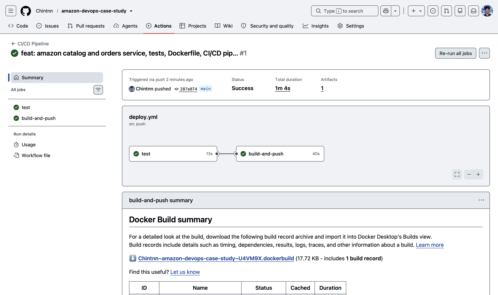
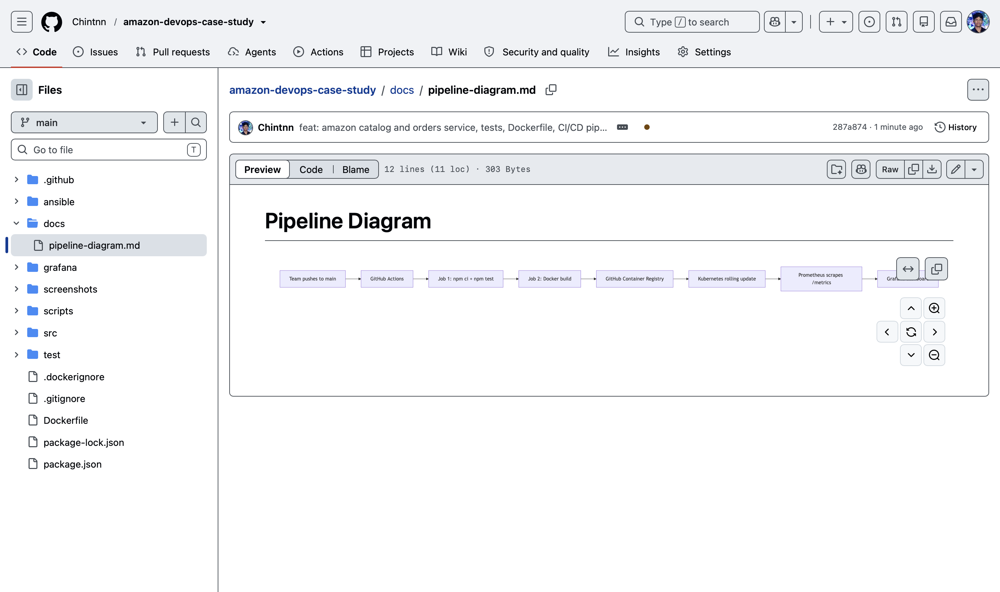
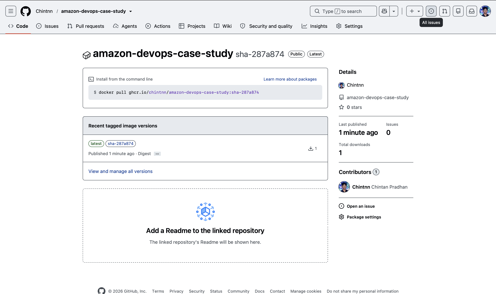

### Task 2 - Configuration Management
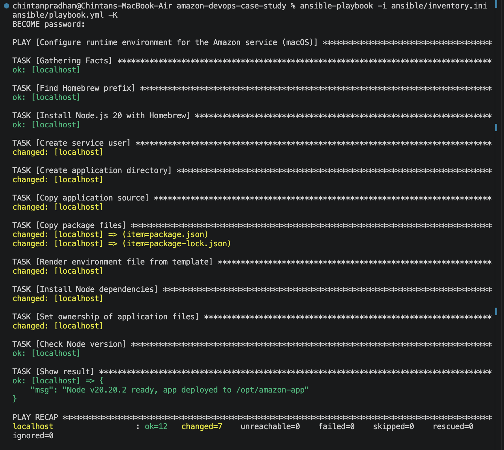
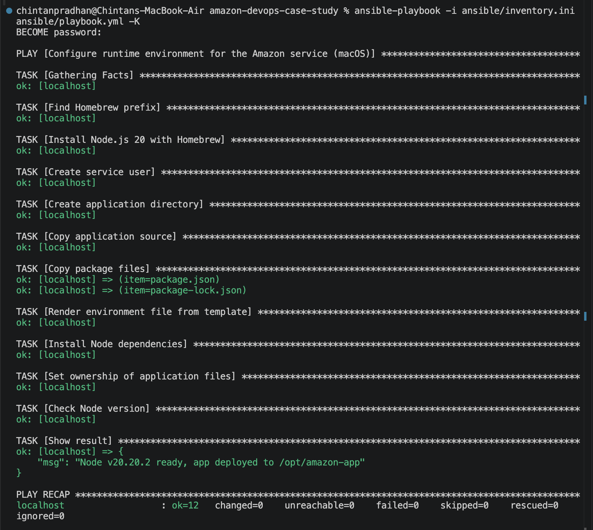
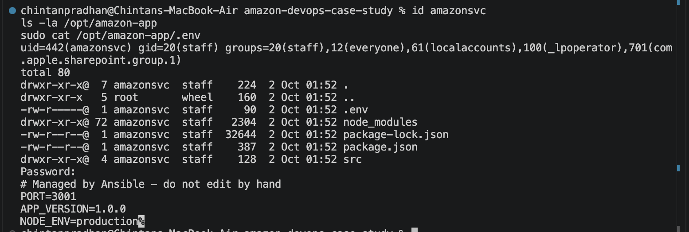

### Task 3 - Containerization & Orchestration
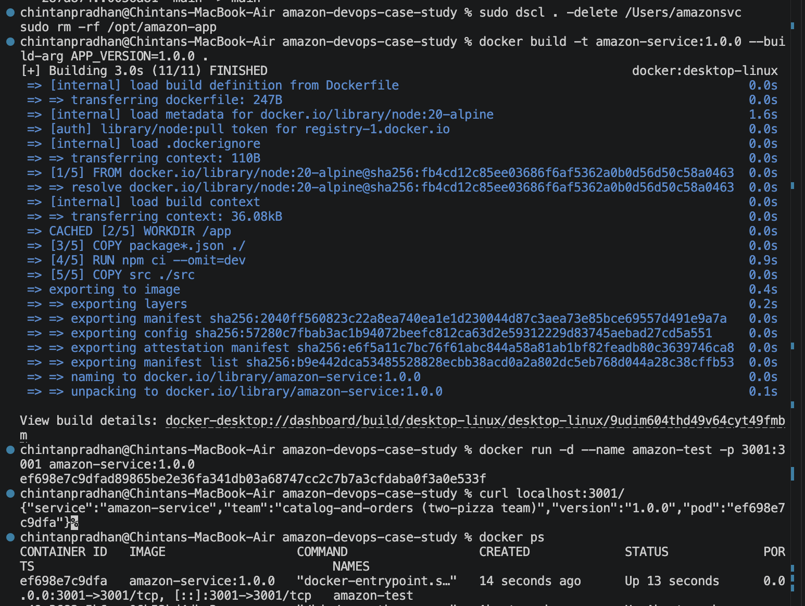
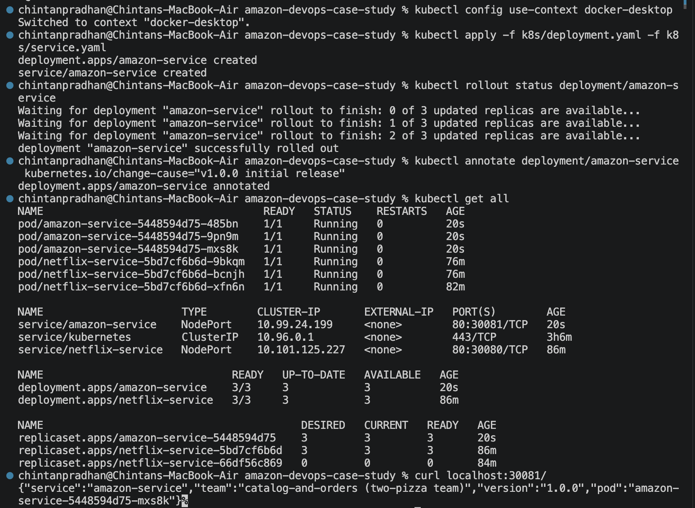
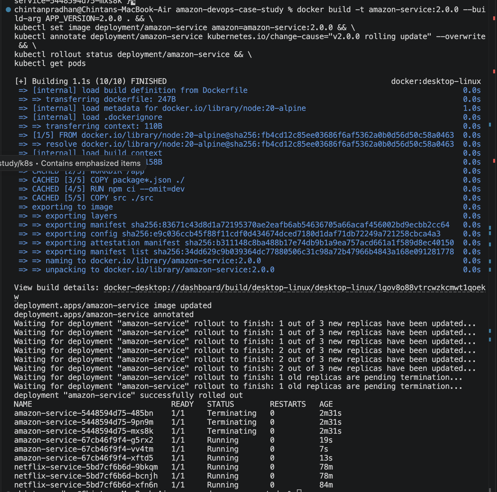
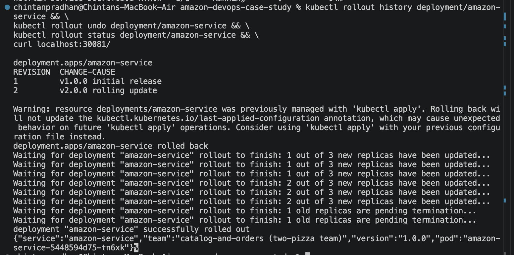
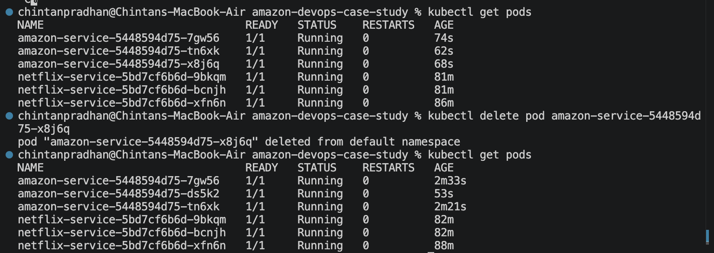

### Task 4 - Monitoring & Logging
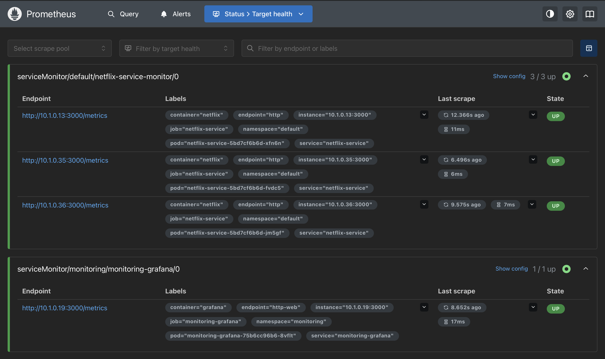
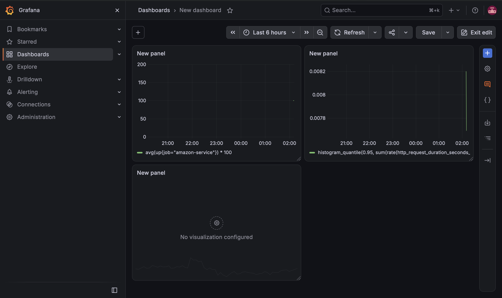

## Challenges Faced
* Linux-oriented tooling on macOS: the Ansible playbook was written for macOS, using Homebrew and a macOS service user instead of apt.
* Homebrew cannot run as root: those Ansible tasks run with `become: false`, while file and user tasks use sudo.
* Resource Constraints: Docker Desktop needed more memory (Settings > Resources) for the monitoring stack.
* ServiceMonitor Discovery: Prometheus ignored the ServiceMonitor until it had the label `release: monitoring`.
* Local Images in Kubernetes: Needed `imagePullPolicy: IfNotPresent` so Kubernetes used locally built images.

## Lessons Learned
* Small units ship faster: one small service can be built, tested and released on its own.
* Automation: Ansible, GitHub Actions, and Kubernetes remove manual errors.
* Observability: Prometheus and Grafana show uptime, latency, and error rate at a glance.
* Resilience: rolling updates, rollbacks and self-healing pods keep the service available.
* Microservices fit DevOps: independently deployable services support Amazon's two-pizza team model.

## Connection to Amazon Case Study
Amazon's monolithic architecture caused frequent outages and slow feature releases. By adopting microservices and a "two-pizza team" culture, they enabled autonomous teams to deploy code very frequently, reported at an average of every 11.7 seconds.

This project shows how that works in practice. One small service has its own pipeline, container, Kubernetes deployment and dashboard, so a team can release it again and again without waiting on anyone else, and a failure stays inside that one service.