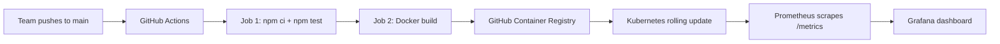

# Pipeline Diagram

```mermaid
flowchart LR
  A[Team pushes to main] --> B[GitHub Actions]
  B --> C[Job 1: npm ci + npm test]
  C --> D[Job 2: Docker build]
  D --> E[GitHub Container Registry]
  E --> F[Kubernetes rolling update]
  F --> G[Prometheus scrapes /metrics]
  G --> H[Grafana dashboard]
```